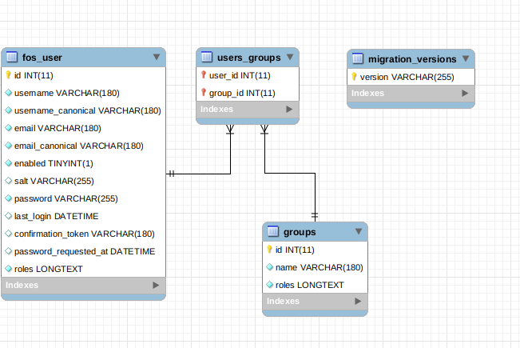

# userManagement

Instructions:

run 'composer install' from code dir

run 'docker-compose up' 

run 'docker exec usermanagement_web_1 /var/www/bin/console doctrine:migrations:migrate'

run 'docker exec usermanagement_web_1 /var/www/bin/console doctrine:fixtures:load'

Database structure:

